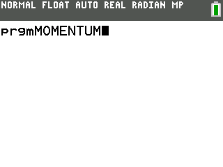

### MOMENTUM:
A work in progress simple game engine, to write games for TI84+ CE line of graphing calculators. Written on top of Ti84+CE C/C++ toolchain. 

### USAGE:
Using the toolchain, ce-programming.github.io/toolchain, you will have to add the momentum folder to your src file. Make sure that if you use graphics.h, you have a folder named "gfx". Use the default folder of
gfx for an easy setup. 

### Newest version:
After some revisions, I can now display a moving sprite, controled by the keypad. 
WORK IN PROGRESS: TILEMAP

### How to use:
TODO: Real wiki

For now, you will have to use this example:

~~~
// graphics and input
#include "momentum/graphics.h"
#include "momentum/input.h"
// for error message
#include "momentum/textControl.h"

// sprite images
#include "gfx/gfx.h"

// include the sprites

/* Main function, called first */
int main(void)
{
    // initializes the screen
    m_StartRender(global_palette);
    // create the "Sprite" object
    Sprite* oiram_sprite = m_CreateSprite(oiram, 100, 100);
    // if could not malloc mem for sprite
    if (oiram_sprite == NULL){
        // error
        m_EndRender();
        m_PrintStr("ERROR: No memory left for image!");
        return 1;
    }
    // render sprite
    m_DrawTransparentSprite(oiram_sprite);
    // draw it to default buffer
    m_FlipBuffer(NULL);
    // exit if newest keypress is clear button
    while(m_GetNewestKeypress()!=kb_Clear);

    // stop rendering
    m_EndRender();
    // free mem used by sprite
    // IMPORTANT: if not done, mem leak
    m_DestroySprite(oiram_sprite);
    return 0;
}
~~~
